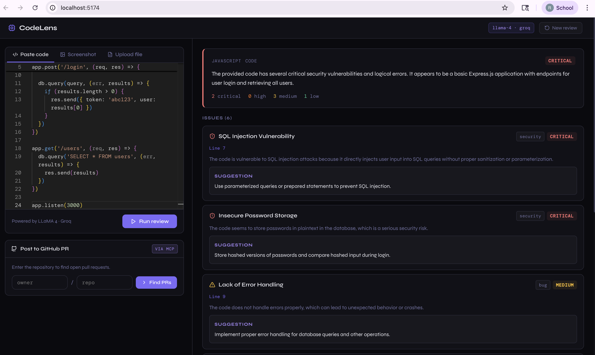

# CodeLens — Multimodal AI Code Review Tool

An AI-powered code review tool that uses **LLaMA 4 via Groq** (multimodal) to review code and UI screenshots, then posts findings directly to GitHub PRs via an **MCP-style GitHub integration**.

## Features

- **Multimodal input** — paste code, upload a code file, or drop a UI screenshot
- **Streaming review** — results stream in real-time via SSE as LLaMA processes
- **Structured output** — issues categorised by type (bug, security, performance, UX, etc.) and severity
- **GitHub MCP integration** — post the formatted review as a PR comment in one click
- **Monaco editor** — full VS Code-style code editor in the browser

## Tech Stack

| Layer | Tech |
|-------|------|
| Frontend | React 18, Vite, Monaco Editor |
| Backend | Node.js, Express, Multer (file upload) |
| LLM | LLaMA 4 Scout via Groq Inference API |
| MCP / GitHub | Octokit (MCP-style tool interface) |
| Streaming | Server-Sent Events (SSE) |

## Project Structure

```
code-reviewer/
├── backend/
│   ├── server.js              # Express entry point
│   ├── routes/
│   │   ├── review.js          # POST /api/review  (SSE streaming)
│   │   └── github.js          # POST /api/github/pr-comment
│   ├── services/
│   │   └── gemini.js          # Groq LLaMA multimodal service
│   ├── mcp/
│   │   └── github.js          # MCP-style GitHub tools + markdown formatter
│   ├── .env.example
│   └── package.json
└── frontend/
    ├── src/
    │   ├── App.jsx
    │   ├── components/
    │   │   ├── InputPanel.jsx  # Code editor + file/image upload tabs
    │   │   ├── ReviewPanel.jsx # Streaming results display
    │   │   └── GitHubPanel.jsx # PR picker + post comment flow
    │   └── hooks/
    │       ├── useReview.js    # SSE streaming hook
    │       └── useGitHub.js    # GitHub API hook
    ├── index.html
    ├── vite.config.js
    └── package.json
```

## Setup

### 1. Get API keys

**Groq (free):**
1. Go to https://console.groq.com
2. Sign up / log in → click **API Keys** → **Create API key**
3. Copy the key

**GitHub token:**
1. Go to https://github.com/settings/tokens
2. Click **Generate new token (Fine-grained)**
3. Set **Repository access** → All repositories
4. Under Permissions set **Pull requests** → Read and write, **Contents** → Read-only
5. Copy the token

### 2. Backend setup

```bash
cd backend
npm install
cp .env.example .env
# Edit .env and add your GROQ_API_KEY and GITHUB_TOKEN
npm run dev
```

Backend runs on http://localhost:3001

### 3. Frontend setup

```bash
cd frontend
npm install
npm run dev
```

Frontend runs on http://localhost:5173

## Usage

1. **Paste code** in the Monaco editor, or switch tabs to upload a file or screenshot
2. Click **Run review** — results stream in on the right panel
3. Once complete, expand **Post to GitHub PR** in the left panel
4. Enter `owner/repo`, select an open PR, and click **Post review comment**

## Extending with full MCP server

The `backend/mcp/github.js` file uses the MCP SDK patterns and mirrors the tool interface of the official `@modelcontextprotocol/server-github` server. To swap in the full MCP server:

```bash
# Install the official GitHub MCP server
npx @modelcontextprotocol/server-github
```

Then update `backend/mcp/github.js` to use `StdioClientTransport` and connect to the spawned process. The tool call signatures (`create_pr_review_comment`, `list_pull_requests`, etc.) remain identical.

## Environment Variables

| Variable | Description |
|----------|-------------|
| `GROQ_API_KEY` | Groq API key (free at console.groq.com) |
| `GITHUB_TOKEN` | GitHub Fine-grained token with PR read/write access |
| `PORT` | Backend port (default: 3001) |

## Preview


